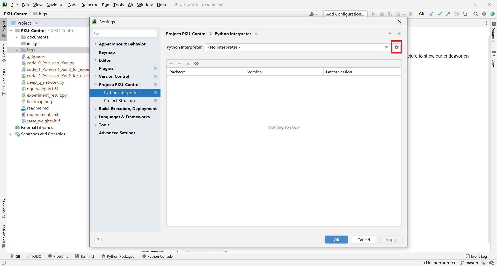
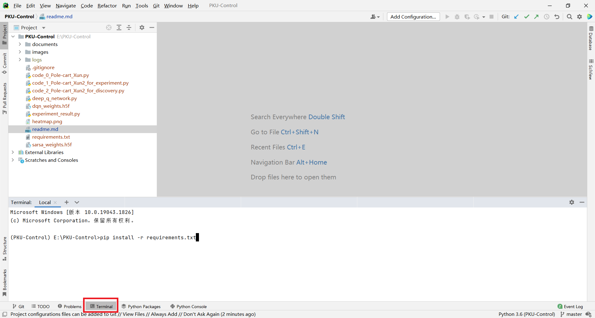

# PKU-Control

This is the Github repository for the report of the course Fundamentals of Control Theory. In this repository, we display the project structure to show our endeavor on experiments and discovery of the keras-rl-based sample code. We also document the steps in order to make the project executable.

## Step 1: Software Installation

### Anaconda

https://www.anaconda.com/

### Git (If you want to use it to clone the project)

https://git-scm.com/

### IDE (We use Pycharm for example)

https://www.jetbrains.com/pycharm/

## Step 2: Clone the Project

Clone the project folder into your computer by either way:

1. Using zip download, OR
2. Right click and choose "Git Bash Here" somewhere on your PC, then type the command

 	`git clone https://github.com/xrr-233/PKU-Control`

## Step 3: Environment Configuration

After software installation, open "Anaconda Prompt" in the Start Menu. In the window, enter:

`conda create -n PKU-Control python=3.6`

This will create an environment called PKU-Control.

When cloned the project, open the project folder “PKU-Control” using Pycharm.

In File > Settings > Project: PKU-Control > Python Interpreter, click the gear icon.

Then click "Add...", select "Conda Environment", and choose "Existing environment", and find your Anaconda environment path (usually in C:\Users\\{{your user name}}\\.conda\\envs\\PKU-Control\\python.exe), then click "OK".

After that, open the terminal and type

`pip install -r requirements.txt`

like:

Then wait for installation.

## Run

Then you can modify and run the desired code by typing

`python ***.py`

in the terminal.

## Appendices

Document link

https://docs.google.com/document/d/1_6HnpUWF0NsLVRyq94hR7P59fmOf9Y2581-f4fCNbqg/edit